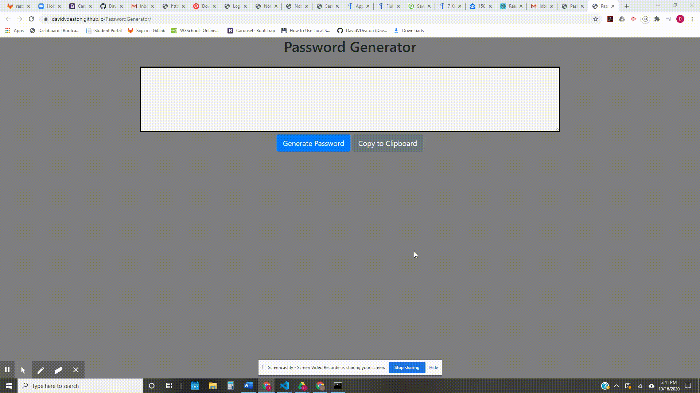

# Project Name
  Password Generator

# Table of contents
- [Project Name](#project-name)
- [Table of contents](#table-of-contents)
- [General info](#general-info)
- [Video Demo](#video-demo)
- [Technology](#technology)
- [Status](#status)
- [Create By](#create-by)

# General info
This password generator will create a random password between 8 and 128 characters, as selected by the user, and runs once the user selects the "Generate Password" button.

The password will be comprised by character sets selected by the user and then randomly selected by the application.

User will be alerted if their password is too short, too long or if they did not select at least one of the four character sets.

Additionally, the user will be able to easily copy the generated password to their clipboard to paste as needed.

Please visit [https://davidvdeaton.github.io/PasswordGenerator/](https://davidvdeaton.github.io/PasswordGenerator/) for the site.

# Video Demo

# Technology
The following technologies have been used for this project:

  1. HTML
  2. CSS
  3. Bootstrap
  4. JavaScript

# Status
Project status: finished

# Create By
Created by David Deaton